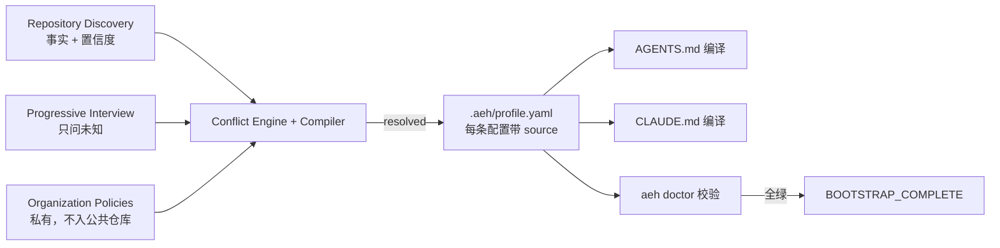
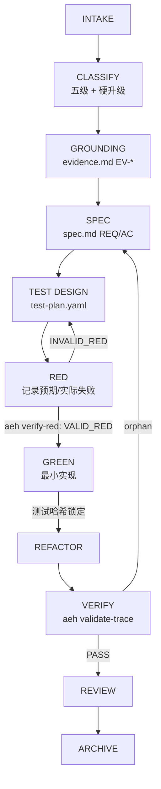

# AEH V0.1 仓库全景图（Repository Panorama）

> ⚠️ **已废弃（SUPERSEDED）**：本文件已被 `docs/repository-panorama_v0.2.md` 取代。请勿以本文件为设计依据；v0.2 与 `docs/architecture.md` 为准。
>
> 状态：DRAFT v0.1（Phase 0 交付物之一，architecture.md 的附录）
> 用途：冻结"V0.1 完成后仓库最终长什么样"。审阅通过后再动 core/ 与 schemas/。
> 原则：本文描述**目标形态**；实施顺序与 Gate 见工程任务书 §30。

---

## 0. 三个视角

这个仓库的价值分三层呈现，各自对应一份"地图"：

| 视角 | 位置 | 说明 |
|---|---|---|
| 仓库本体 | 本仓库 | 别人 clone 到的公共分发物 |
| 用户项目 | 用户项目的 `.aeh/` 与 `AGENTS.md`/`CLAUDE.md` | Bootstrap 之后生成 |
| 任务运行时 | 用户项目的 `.aeh/changes/CHG-*` | 每次开发任务的工件与证据 |

---

## 1. 全景总图（五层架构 ↔ 目录 ↔ 数据流）

```text
┌────────────────────────────────────────────────────────────────┐
│                adaptive-engineering-harness（公共仓库）           │
├────────────────────────────────────────────────────────────────┤
│ Layer 1  core/        通用语义契约：workflow / states / gates /   │
│                        precedence / classifications / evidence    │
│                          ↑ 只定义"什么叫 Change/Gate/Evidence"     │
│                          │ 零公司硬编码（验收红线）                  │
├────────────────────────────────────────────────────────────────┤
│ Layer 2  bootstrap/   读仓库事实(discovery) + 渐进访谈(interview)  │
│                        + 冲突规则(conflict-rules)                  │
│                          ↓                                        │
├────────────────────────────────────────────────────────────────┤
│ Layer 3  Profile      .aeh/profile.yaml（用户项目内）              │
│                        Canonical Configuration：每条配置带来源       │
│                          ↓ 编译                                    │
├────────────────────────────────────────────────────────────────┤
│ Layer 4  adapters/    codex/  claude/                             │
│                        AGENTS.md、CLAUDE.md 只是"薄入口"            │
│                          ↓ 驱动                                    │
├────────────────────────────────────────────────────────────────┤
│ Layer 5  Runtime      skills/（五级工作流技能）+ templates/（分层    │
│                        工件）+ tools/aeh（Validator 机器门禁）       │
└────────────────────────────────────────────────────────────────┘
```

**四层分工（工程任务书 §32 冻结的边界）：**

| 层 | 角色 | 载体 |
|---|---|---|
| LLM | reasoning：发现、建议、执行 | Codex / Claude / 其他 Agent |
| Schema | contract：什么合法 | `core/*.yaml` + `schemas/*.json` |
| Validator | enforcement：Gate 不可绕过 | `tools/aeh/validate-*` + `doctor` |
| Git | evidence：RED/结论落盘可复核 | `.aeh/changes/*` + commit |

---

## 2. 仓库目录与逐项职责

```text
adaptive-engineering-harness/
│
├── README.md                     # 一条命令起步：aeh doctor → 初始化 AEH
├── LICENSE / CONTRIBUTING.md
├── AGENTS.md                     # 薄入口：只指路，不复制规则
├── CLAUDE.md                     # 同上；两者都是 Adapter 产物，不各自成体系
│
├── core/                         # ★ Source of Truth（通用语义，零公司硬编码）
│   ├── workflow.yaml             # 五级工作流的阶段序列（DIRECT/LIGHTWEIGHT/STANDARD/CRITICAL/EXPLORE）
│   ├── states.yaml               # 状态机：全部状态 + 合法/非法迁移表
│   ├── gates.yaml                # 每级工作流的 Gate 清单与放行条件
│   ├── precedence.yaml           # system>organization>project>team>task>developer>default
│   ├── classifications.yaml      # 五级分类 + 风险评分维度 + 硬升级规则（经济/持久化/协议/安全/不可逆迁移）
│   └── evidence.yaml             # 证据三档（direct/indirect/inferred）+ RED 证据字段
│
├── bootstrap/
│   ├── discovery/                # 6 份扫描清单：仓库/测试/CI/Git/AI规则/架构
│   │   ├── repository.yaml       #   语言/框架/包管理器/构建系统/README/文档
│   │   ├── testing.yaml          #   测试框架/测试目录/运行命令
│   │   ├── ci.yaml               #   CI 平台/流水线/lint/formatter
│   │   ├── git.yaml              #   git root/hooks/分支策略
│   │   ├── ai-rules.yaml         #   AGENTS.md/CLAUDE.md/规则目录
│   │   └── architecture.yaml     #   目录结构/模块边界（置信度往往最低）
│   ├── interview/                # 5 份问题集（只问 Discovery 无法确定的事）
│   │   ├── core.yaml             #   工作方式/修改权限/Git/Review/Test/高风险/公司规则/报告
│   │   ├── developer.yaml        #   个人偏好（优先级最低）
│   │   ├── team.yaml             #   团队规则
│   │   ├── organization.yaml     #   组织规程（优先级高，且不进公共仓库）
│   │   └── ai-permissions.yaml   #   AI 允许/禁止的操作
│   ├── conflict-rules.yaml       # 冲突判定；同级组织规则冲突 → BLOCKED_POLICY_CONFLICT
│   └── bootstrap-workflow.md     # 完整 Bootstrap 流程（先读仓库，再问人）
│
├── policies/                     # 按域的可选策略包（guidance 性质，非强制）
│   ├── sdd/  tdd/  testing/  review/
│   ├── git/  security/  release/
│
├── templates/                    # 按风险等级的分层工件模板
│   ├── direct/                   #   最小：change.yaml
│   ├── lightweight/              #   change + bugfix + verification
│   ├── standard/                 #   spec/test-plan/tasks/traceability/evidence/verification
│   ├── critical/                 #   + design/decisions + 人工 Gate 记录
│   └── explore/                  #   hypothesis/experiment/evidence/decision
│
├── schemas/                      # 机器契约（JSON Schema，Validator 的判定依据）
│   ├── profile.schema.json       # Profile 合法性
│   ├── change.schema.json        # Change 工件
│   ├── spec.schema.json          # REQ/AC 最低模型（禁止无 ID 的自然语言大段）
│   ├── traceability.schema.json  # REQ↔AC↔TEST↔TASK 双向链路
│   └── verification.schema.json  # 验证结论（含 RED 证据）
│
├── adapters/
│   ├── codex/
│   │   ├── README.md
│   │   ├── AGENTS.template.md    # 薄入口模板：读 profile → 分类 → 按工作流走 → 勿绕 Gate
│   │   └── adapter.yaml          # Profile 字段 → AGENTS.md 语句的编译映射 + 权限映射
│   └── claude/
│       ├── README.md
│       ├── CLAUDE.template.md
│       └── adapter.yaml          # V1 仅 CLAUDE.md + permissions mapping（不做 Hooks）
│
├── skills/                       # Runtime 的执行技能（五级工作流共用原子技能）
│   ├── bootstrap/                #   Bootstrap 编排（对应 Layer 2 全流程）
│   ├── classify-change/          #   分类引擎（评分 + 硬升级）
│   ├── grounding/                #   只搜集事实，产出 evidence.md（EV-*）
│   ├── specification/            #   只定义契约，产出 spec.md（REQ/AC）
│   ├── red/                      #   先写会失败的测试，记录 RED 证据
│   ├── green/                    #   最小实现，禁止改测试
│   ├── verify/                   #   验证 + 回归 + trace 校验
│   └── archive/                  #   归档 + 决策记录 + Spec 生命周期治理
│
├── tools/aeh/                    # ★ 唯一的真代码：Validator 五件套（enforcement）
│   ├── validate-profile          # Profile schema 校验（非法字段拒绝）
│   ├── validate-change           # Change 工件校验（缺失/格式错误拒绝）
│   ├── validate-trace            # 双向 Traceability（orphan REQ/AC/TEST 检出）
│   ├── verify-red                # RED 证据判定：VALID_RED / INVALID_RED
│   └── doctor                    # 全链自检：Core/Profile/Adapter/Workflow/测试命令/Git/冲突/当前 Change 状态/Traceability
│
├── examples/                     # 三个落地样板（证明"不过度工程化"）
│   ├── minimal/                  #   Python/JS 小项目走 Lightweight
│   ├── dotnet/                   #   ASP.NET 走 Standard SDD+TDD
│   └── unity/                    #   Unity EditMode/PlayMode/Runtime 走 Critical
│
├── tests/                        # Harness 自测（对应工程任务书 §27 十项）
│
└── docs/
    ├── architecture.md           # 六条冻结原则（Phase 0 主文档）
    ├── repository-panorama.md    # 本文档
    ├── bootstrap.md / workflow.md / customization.md / security.md
```

**"不会有"的东西**（V1 排除项）：Web 后台、数据库、云端服务、RAG、SaaS、全自动多 Agent 调度器、Spec 全项目生成、自研 Coding Agent。
仓库形态 = Git + Markdown + YAML/JSON Schema + 少量 Python/Node Validator + Agent Instructions + Bootstrap Skills + Templates。

---

## 3. 关键数据流

### 3.1 Bootstrap 流（一次）



### 3.2 标准任务流（每次；Critical 在其上加人工 Gate 与 DRIFT/HUMAN MERGE GATE）



### 3.3 优先级解析流（Compiler 内部）

```text
Facts（discovery，置信度标注）
  → Rules（developer/team/project/organization）
  → Resolve precedence（core/precedence.yaml）
  → Resolve conflicts（同级冲突 → BLOCKED_POLICY_CONFLICT，禁止静默覆盖）
  → Apply defaults（harness 默认，最低优先级）
  → Validate（validate-profile）
  → Generate Profile（结构化数据，≠ Prompt）
```

---

## 4. 用户项目与任务运行时产物

### 4.1 用户项目（Bootstrap 之后）

```text
MyGame/
├── .aeh/
│   ├── profile.yaml              # Canonical Configuration（source 可追溯）
│   ├── workflow.yaml             # 本项目生效的工作流
│   ├── project/                  # 公开：项目通用工程规则
│   ├── private/                  # 私有：公司规程/内部路径（默认 gitignore）
│   ├── bootstrap/discovery.yaml  # 仓库事实（DETECTED/INFERRED/USER_CONFIRMED/UNKNOWN）
│   └── changes/                  # 任务工件
├── AGENTS.md                     # 薄入口（从 profile 编译）
└── CLAUDE.md
```

### 4.2 分层工件（同一 Change 在不同等级下生成的工件不同）

| 工件 | Direct | Lightweight | Standard | Critical |
|---|---|---|---|---|
| change.yaml | ✅ | ✅ | ✅ | ✅ |
| evidence.md | — | — | ✅ | ✅ |
| bugfix.md | — | ✅ | — | — |
| spec.md（REQ/AC） | — | ✅轻量 | ✅ | ✅ |
| design.md | — | — | — | ✅ |
| test-plan.yaml | — | ✅回归 | ✅ | ✅ |
| tasks.md | — | — | ✅ | ✅ |
| traceability.yaml | — | — | ✅ | ✅ |
| verification.md（含 RED） | ✅基础 | ✅ | ✅ | ✅ |
| decisions.md | — | — | — | ✅ |

---

## 5. 机器强制点清单（enforcement surface）

| 强制点 | 载体 | 防什么绕过 |
|---|---|---|
| 分类硬升级 | classifications.yaml + classify-change | 高风险改动被当成小修 |
| 状态机迁移 | states.yaml + validate-change | GROUND→GREEN 跳 Gate；Critical SPEC→IMPLEMENT 绕过 RED |
| RED 证据 | verify-red | "因错误原因失败"冒充 RED；没跑测试声称已验证 |
| Green 测试锁 | 测试文件哈希 + validate-change | AI 改测试后宣布成功（BLOCKED_TEST_CHANGED） |
| 双向追溯 | validate-trace | orphan REQ/AC/TEST；有实现无需求依据 |
| 同级冲突 | conflict-rules.yaml + validate-profile | 组织规则 A vs B 被静默覆盖 |
| 全链体检 | doctor | 用户 clone 后环境不齐、profile 损坏、冲突未决 |
| 私有数据隔离 | .aeh/private/ + 默认 .gitignore | 公司规程/Token/内部路径误提交公共仓库 |

**注意**：policies/ 目录是 guidance（建议），只有 tools/aeh + schemas/ 是 enforcement（强制）——两者严格分开（工程任务书 §23）。

---

## 6. 与 sdd-agent-kit 的资产迁移映射

| sdd-agent-kit 现有资产 | AEH 归宿 | 变化 |
|---|---|---|
| 9 个 sdd-* 技能 | skills/ 的 bootstrap/grounding/spec/red/green/verify/archive 种子 | 从"流程说明"变为"状态机内的执行技能" |
| 14 份模板 | templates/standard（再按风险拆分到五级） | 从"全任务一套"变为"分级工件" |
| sdd-selfcheck 6 个 Python 脚本 | tools/aeh/validate-* 原型 | 严格链经验直接继承（critic_gate_report 重算模式） |
| G1~G6 门禁文档 | core/gates.yaml + 状态机 Validator | 文档 → 机器强制 |
| 12 态状态机 | core/states.yaml | 手动跟踪 → 非法跳转被拒 |
| 证据三档 | core/evidence.yaml + verification.schema.json | 理念 → Schema |
| 角色契约 + Reviewer 四档裁决 | skills/ + policies/review | 保留独立审查环 |
| L1~L4 自检等级 | classifications.yaml 风险评分 + 五级分类 | 合并硬升级规则 |

---

## 7. V0.1 范围边界

**P0（16 项，按实施顺序）**：Core Schema → Rule Precedence → Repository Discovery → Progressive Interview → Project Profile → Conflict Engine → Change Classification → Runtime State Machine → Codex Adapter → Claude Adapter → Change Workspace → Grounding → Spec/AC Schema → Traceability Validator → RED Evidence → Doctor。

**P1**：Unity/.NET Examples、Test Lock、CI Example、Metrics/Pilot。

**P2（后置）**：Mutation Testing、Impact Test Selection、Automatic Drift Detection、Property Generator。

**P3（后置）**：RAG、Web UI、全自动 Multi-Agent Orchestrator、Cloud Service。

---

## 8. MVP DoD ↔ 全景图对照

| DoD 步骤 | 由仓库的哪个组件实现 |
|---|---|
| clone 后 Codex/Claude 可识别 | AGENTS.md / CLAUDE.md（薄入口）+ README |
| 运行 Bootstrap | skills/bootstrap + bootstrap/ 配置 |
| 自动发现 Repository Facts | bootstrap/discovery/*.yaml + grounding 方法 |
| 询问必要问题 | bootstrap/interview/*.yaml（渐进，不问已知） |
| 解决规则优先级 | core/precedence.yaml + conflict-rules.yaml |
| 生成 Project Profile | .aeh/profile.yaml + validate-profile |
| 生成对应 Adapter | adapters/codex + adapters/claude |
| 任务正确分类 | skills/classify-change + classifications.yaml |
| 创建 Change Workspace | .aeh/changes/CHG-* + validate-change |
| 按状态机运行 | core/states.yaml + skills/* |
| Standard 闭环 Ground→Spec→RED→Green→Verify | skills/grounding→specification→red→green→verify |
| Traceability Validator PASS | tools/aeh/validate-trace |
| Doctor PASS | tools/aeh/doctor |

---

## 9. 全景图验收自查（Phase 0 红线）

- [ ] core/ 六个文件**零**特定引擎/框架/公司/用户硬编码；
- [ ] AGENTS.md 与 CLAUDE.md 只是薄入口，不复制规则、不形成两套工作流；
- [ ] Profile 每条配置带 source 与 confidence；
- [ ] 同级组织规则冲突必须 BLOCKED_POLICY_CONFLICT；
- [ ] .aeh/private/ 默认 .gitignore；
- [ ] Guidance（policies/）与 Enforcement（tools/aeh + schemas/）严格分离；
- [ ] 每个 Phase 单独提交、单独审查，不做 150 文件大 PR。