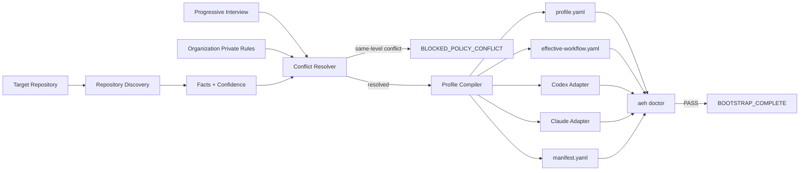

# AEH V0.2 仓库全景图（Repository Panorama）

> 状态：DESIGN BASELINE v0.2（V02-0，2026-08-19）；M1–M4 已合并，v0.2.0
> 已发布；当前源码为未发布的 `0.3.0.dev0` 开发线；PyPI 未发布
>
> 注意：本文档描述 V0.2 目标形态；其中尚未在 V0.1 落地的目录与能力（如 policies/、
> skills/、templates/、merge-rules、dotnet/unity 示例）不代表 V0.1 已存在。
> V0.1 实际能力见 README §13 与 CHANGELOG.md。
>
> 证据边界：Handbook/Phase 1.1 的软件证据快照仍为 `v0.1.0 @ 6513102`；当前仓库
> 最新发布版本为 `v0.2.0`，当前源码版本为 `0.3.0.dev0`。Phase 2 v1.10 已完成
> 72-run 并给出 `REPOSITION`；RUN-F055 完整性逃逸已修复，定向修复复测与攻击评估已
> 阻断已知逃逸，但产品有效性仍为 `NOT_YET_PROVEN`。
>
> v0.2 统一边界：AEH 是独立 Change Assurance System；Generator 与 Acceptance
> Authority 分离；Task Outcome 与 Assurance Outcome 分离；G3 Route B 是实验性
> External Runner；任何直接机器事实修改都必须显式进入 Integrity Evidence。
>
> 用途：冻结 **AEH V0.1 完成后仓库最终长什么样、如何安装到用户项目、哪些内容是机器真值、哪些规则由谁定义与强制、任务运行时如何留证**。
>
> 本版来源：基于 `repository-panorama.md v0.1` 与 Phase 0 架构审查修订。
>
> 本版目标：在创建 `core/*.yaml` 与 `schemas/*.json` 之前，先冻结不可逆工程契约，避免边写 Schema 边重新设计系统。
>
> 实施原则：本文描述**目标形态与边界**；实际实现按 Phase 单独提交、单独审查，不允许一次性大 PR。

---

## 0. 三个视角 + 一个安装桥

AEH 的价值需要从四个视角理解：

| 视角 | 位置 | 说明 |
|---|---|---|
| 公共分发仓库 | `adaptive-engineering-harness/` | GitHub 上别人 clone 的通用 Harness |
| 安装桥 | `aeh bootstrap <target>` | 将公共 Harness 安装/编译进用户项目 |
| 用户项目 | 用户仓库内 `.aeh/` + `AGENTS.md` / `CLAUDE.md` | Bootstrap 后形成的项目级工程约束 |
| 任务运行时 | `.aeh/changes/CHG-*` | 每个 Change 独立保存状态、规格、测试与证据 |

必须避免把四者混为一体：

```text
公共 Harness ≠ 用户项目配置 ≠ Agent Prompt ≠ 单次任务工件
```

AEH V0.1 的核心不是“让用户永远在 Harness 仓库里工作”，而是：

```text
GitHub AEH Repo
    ↓
clone / checkout
    ↓
aeh bootstrap <TARGET_REPO>
    ↓
Discovery + Interview + Conflict Resolution
    ↓
Profile Compiler
    ↓
安装 versioned runtime snapshot
    ↓
生成用户项目 .aeh/
    ↓
Codex / Claude 在用户项目中运行
```

---

## 1. 全景总图：五层架构 + 三类执行边界

### 1.1 五层架构

```text
┌──────────────────────────────────────────────────────────────────┐
│               adaptive-engineering-harness（公共仓库）            │
├──────────────────────────────────────────────────────────────────┤
│ Layer 1  Core                                                   │
│ core/ + schemas/                                                │
│ 通用语义、状态、分类、优先级、Gate、证据结构                     │
│ ★ 零公司 / 零项目 / 零用户硬编码                                 │
├──────────────────────────────────────────────────────────────────┤
│ Layer 2  Bootstrap                                              │
│ bootstrap/ + bootstrap skill                                    │
│ 读取仓库事实 + 渐进访谈 + 组织规则输入 + 冲突解析                  │
├──────────────────────────────────────────────────────────────────┤
│ Layer 3  Project Profile                                        │
│ 用户项目 .aeh/profile.yaml + effective-workflow.yaml             │
│ Canonical Configuration：每条有效配置带 source/confidence         │
├──────────────────────────────────────────────────────────────────┤
│ Layer 4  Agent Adapters                                         │
│ adapters/codex + adapters/claude                                │
│ AGENTS.md / CLAUDE.md 只作为薄入口，不保存第二套工作流             │
├──────────────────────────────────────────────────────────────────┤
│ Layer 5  Runtime                                                │
│ skills/ + templates/ + aeh CLI + validators                     │
│ CLASSIFY → GROUND → SPEC → TEST → RED → GREEN → VERIFY...       │
└──────────────────────────────────────────────────────────────────┘
```

### 1.2 三类工程边界

v0.1 中“Guidance / Enforcement”二分不够精确。V0.2 冻结为三层：

| 层 | 作用 | 主要载体 | 是否直接决定合法性 |
|---|---|---|---|
| **Guidance** | 告诉 Agent 应如何工作 | `policies/`、`skills/`、README、Prompt | 否 |
| **Normative Contract** | 定义什么状态/数据/迁移才合法 | `core/*.yaml`、`schemas/*.json` | 定义合法性 |
| **Enforcement Engine** | 对实际状态进行独立判定并阻止绕过 | `aeh` CLI、validators、CI、文件/工具权限 | 是 |

因此必须明确：

```text
states.yaml 定义“什么迁移合法”
Validator 判断“当前迁移是否合法”

schema 定义“数据结构合法条件”
Validator 判断“当前文件是否符合结构”

policy 告诉 Agent“应该做什么”
policy 本身不能等价于强制
```

### 1.3 四层责任模型

继续保留原 v0.1 的四层思想，但做精确定义：

| 层 | 角色 | 载体 |
|---|---|---|
| LLM | Reasoning：发现、建议、解释、执行 | Codex / Claude / 其他 Agent |
| Contract | 定义合法状态与数据 | `core/` + `schemas/` |
| Validator | 独立重算与强制 | `aeh validate-*` / `aeh doctor` / CI |
| Evidence | 保存可复核事实 | Git base SHA + 文件 Hash + Test Output + Change Artifacts |

注意：

> Git 是最强 Evidence Carrier 之一，但 **Evidence 不等于必须 Commit**。

当 Profile 禁止 Agent commit 时，RED/验证仍必须可复核。

---

## 2. 公共仓库目录与逐项职责

```text
adaptive-engineering-harness/
│
├── README.md
├── LICENSE
├── CONTRIBUTING.md
├── pyproject.toml                 # V0.1 建议使用单一 Python CLI 包
├── AGENTS.md                     # AEH 自身仓库开发时的薄入口
├── CLAUDE.md                     # 同上
│
├── core/                         # ★ Normative Contract / Source of Truth
│   ├── workflow.yaml             # 五级工作流阶段定义
│   ├── states.yaml               # 状态机 + 合法迁移
│   ├── gates.yaml                # Gate 定义、进入/退出条件
│   ├── precedence.yaml           # 规则优先级
│   ├── classifications.yaml      # 分类评分 + 硬升级
│   └── evidence.yaml             # 证据类型、置信度、RED字段要求
│
├── bootstrap/
│   ├── discovery/
│   │   ├── repository.yaml
│   │   ├── testing.yaml
│   │   ├── ci.yaml
│   │   ├── git.yaml
│   │   ├── ai-rules.yaml
│   │   └── architecture.yaml
│   ├── interview/
│   │   ├── core.yaml
│   │   ├── developer.yaml
│   │   ├── team.yaml
│   │   ├── organization.yaml
│   │   └── ai-permissions.yaml
│   ├── conflict-rules.yaml
│   ├── merge-rules.yaml           # Existing AGENTS/CLAUDE 非破坏式合并
│   └── bootstrap-workflow.md
│
├── policies/                     # Guidance，不是强制引擎
│   ├── sdd/
│   ├── tdd/
│   ├── testing/
│   ├── review/
│   ├── git/
│   ├── security/
│   └── release/
│
├── templates/
│   ├── direct/
│   ├── lightweight/
│   ├── standard/
│   ├── critical/
│   └── explore/
│
├── schemas/                      # Machine-readable contracts
│   ├── manifest.schema.json
│   ├── profile.schema.json
│   ├── effective-workflow.schema.json
│   ├── change.schema.json
│   ├── bugfix.schema.json
│   ├── spec.schema.json
│   ├── test-plan.schema.json
│   ├── tasks.schema.json
│   ├── traceability.schema.json
│   ├── verification.schema.json
│   └── approvals.schema.json
│
├── adapters/
│   ├── codex/
│   │   ├── README.md
│   │   ├── AGENTS.template.md
│   │   └── adapter.yaml
│   └── claude/
│       ├── README.md
│       ├── CLAUDE.template.md
│       └── adapter.yaml
│
├── skills/
│   ├── bootstrap/
│   ├── classify-change/
│   ├── grounding/
│   ├── specification/
│   ├── test-design/
│   ├── red/
│   ├── green/
│   ├── refactor/
│   ├── verify/
│   ├── review/
│   └── archive/
│
├── src/aeh/                      # ★ V0.1 唯一正式实现代码
│   ├── cli.py
│   ├── bootstrap/
│   ├── compiler/
│   ├── validators/
│   │   ├── profile.py
│   │   ├── change.py
│   │   ├── trace.py
│   │   ├── red.py
│   │   ├── state.py
│   │   └── approvals.py
│   ├── adapters/
│   └── doctor/
│
├── examples/
│   ├── minimal/
│   ├── dotnet/
│   ├── unity/
│   └── enterprise/
│
├── tests/
│   ├── unit/
│   ├── integration/
│   └── fixtures/
│
└── docs/
    ├── architecture.md
    ├── repository-panorama.md
    ├── bootstrap.md
    ├── workflow.md
    ├── customization.md
    └── security.md
```

V0.1 排除：

```text
Web 后台
数据库
云端服务
RAG
SaaS
全自动多 Agent 调度器
Spec 全项目生成
自研 Coding Agent
自动修改公司政策
```

---

## 3. 用户项目安装后的目标形态

Bootstrap 完成后，用户项目中生成：

```text
MyProject/
│
├── .aeh/
│   ├── manifest.yaml
│   ├── profile.yaml
│   ├── effective-workflow.yaml
│   │
│   ├── runtime/
│   │   ├── core/
│   │   ├── schemas/
│   │   └── skills/
│   │
│   ├── generated/
│   │   ├── codex/
│   │   └── claude/
│   │
│   ├── bootstrap/
│   │   ├── discovery.yaml
│   │   ├── answers.yaml
│   │   ├── conflicts.yaml
│   │   └── compiler-report.yaml
│   │
│   ├── project/
│   │   └── policies/
│   │
│   ├── private/                  # 默认 gitignore
│   │   └── organization/
│   │
│   ├── changes/
│   │   ├── CHG-2026-0001/
│   │   └── CHG-2026-0002/
│   │
│   └── archive/
│
├── AGENTS.md                     # Existing 内容保留；只维护 AEH Managed Section
├── CLAUDE.md                     # 同上
└── .gitignore                    # 增补 .aeh/private/
```

### 3.1 manifest.yaml

必须保存 AEH 自身来源与编译版本：

```yaml
harness:
  name: adaptive-engineering-harness
  version: "0.1.0"
  source_revision: "<git-sha>"

compiler:
  version: "0.1.0"

schema:
  version: "1"

installed_at: "<timestamp>"

source_hashes:
  core: "<sha256>"
  schemas: "<sha256>"
  adapters: "<sha256>"
```

目的：

- 支持后续升级；
- 支持复现 Profile 来源；
- 避免“这个项目到底由哪版 AEH 生成”的事实丢失。

### 3.2 effective-workflow.yaml

公共仓库：

```text
core/workflow.yaml
```

定义 AEH 默认语义。

用户项目：

```text
.aeh/effective-workflow.yaml
```

表示经过：

```text
Core Defaults
+ Organization Policy
+ Project Policy
+ Team Policy
+ Developer Preference
+ Profile
→ Compiler
→ Effective Workflow
```

后的**最终有效工作流**。

禁止二者同名以避免 Source/Effective 混淆。

---

## 4. 机器真值与人类叙述必须分离

V0.1 冻结以下原则：

> **任何 Validator 必须判定的核心事实，不得只存在于自由 Markdown 中。**

### 4.1 机器真值

```text
manifest.yaml
profile.yaml
effective-workflow.yaml
change.yaml
bugfix.yaml
spec.yaml
test-plan.yaml
tasks.yaml
traceability.yaml
verification.yaml
approvals.yaml
```

这些文件：

- 必须有 Schema；
- 必须可被 CLI 独立重算；
- 不依赖 Agent 自觉遵守 Markdown 格式。

### 4.2 人类叙述

```text
evidence.md
design.md
decisions.md
review.md
```

用于：

- 解释原因；
- 记录背景；
- 描述架构权衡；
- 保存人工阅读材料。

Markdown 可以引用机器 ID，但不能反过来成为唯一 Gate 真值。

---

## 5. 关键数据流

### 5.1 Bootstrap 流



### 5.2 规则解析顺序

```text
Repository Facts
  +
Organization Rules
  +
Project Rules
  +
Team Rules
  +
Task Rules
  +
Developer Preferences
  +
Harness Defaults
        ↓
Normalize
        ↓
Resolve Precedence
        ↓
Detect Same-Level Conflict
        ↓
Apply Defaults
        ↓
Validate
        ↓
Compile
        ↓
Profile + Effective Workflow + Adapter
```

### 5.3 规则优先级

```text
System / Tool Safety
    >
Organization
    >
Project
    >
Team
    >
Task
    >
Developer
    >
Harness Default
```

同一级别冲突：

```text
Organization A
vs
Organization B
→ BLOCKED_POLICY_CONFLICT
```

禁止 Agent 自行“选择看起来合理的一条”。

---

## 6. Existing AGENTS.md / CLAUDE.md 的非破坏式安装

Bootstrap 不允许覆盖用户已有 Agent 规则。

### 6.1 基本原则

```text
Existing user content
    ↓ preserve

AEH managed content
    ↓ managed section only
```

建议：

```markdown
<!-- AEH:BEGIN MANAGED -->
AEH generated content
<!-- AEH:END MANAGED -->
```

重复执行：

```text
Bootstrap #1
Bootstrap #2
Bootstrap #3
```

必须满足：

> 除非输入规则变化，否则输出没有额外 diff。

即：

```text
Bootstrap 必须幂等。
```

### 6.2 冲突处理

若已有 AGENTS/CLAUDE 中存在与 AEH Profile 冲突的规则：

```text
发现
→ 记录 conflict
→ 根据来源级别判定
→ 无法自动判定则阻塞
```

不能静默重写用户原文。

---

## 7. Progressive Interview

原则：

> AI 能可靠发现的事实不问用户；涉及价值判断、组织制度、审批责任、个人偏好的事项才询问。

### 7.1 Round 1：核心问题

建议 6~10 项：

- 是否要求修改代码前先输出方案；
- AI 能否直接修改生产代码；
- AI 能否 commit；
- AI 能否 push；
- 哪些 Change 必须 Human Review；
- TDD 是强制、风险驱动还是不强制；
- 是否存在组织/团队研发规程；
- 哪些操作必须人工批准；
- 报告详细程度偏好。

### 7.2 Round 2：条件问题

根据 Discovery + Round 1，只问：

- UNKNOWN；
- INFERRED 但低置信度；
- 会改变 Workflow 的未决事项。

### 7.3 Round 3：冲突决策

仅处理：

```text
USER_DECISION_REQUIRED
BLOCKED_POLICY_CONFLICT
```

---

## 8. Profile Source / Confidence / Provenance

`.aeh/profile.yaml` 的有效配置不得只有值。

最低需要：

```yaml
git:
  push:
    value: deny
    source:
      type: organization_policy
      ref: ORG-GIT-001
    confidence: confirmed
```

Discovery 事实采用：

```text
DETECTED
INFERRED
USER_CONFIRMED
UNKNOWN
```

规则本身至少记录：

```text
source type
source id/ref
confidence
last_updated / hash（能获取时）
```

目的：

> AEH 必须可以回答“为什么这条规则生效”。

---

## 9. Private Policy 不等于 Agent Context

`.aeh/private/` 默认 `.gitignore` 只是第一层保护。

V0.1 还必须冻结：

```text
Private Source
    ↓
Policy Normalizer
    ↓
Effective Constraint
    ↓
Profile / Effective Workflow
    ↓
Agent only sees minimum necessary constraint
```

示例：

原始私有制度：

```text
内部生产数据库、服务器地址、Ops 流程……
```

Agent 真正需要：

```yaml
production_database:
  write: deny
  approval: ops_required
```

原则：

> **Private 原文不应默认复制到 AGENTS.md、CLAUDE.md、Change Evidence 或公开日志。**

需要保留：

- redaction；
- minimum disclosure；
- no secret echo；
- private ref 只保存 ID，不复制正文。

---

## 10. Change Classification

每个任务首先：

```text
INTAKE
→ CLASSIFY
```

五级：

```text
DIRECT
LIGHTWEIGHT
STANDARD
CRITICAL
EXPLORE
```

### 10.1 评分维度

```text
Business Impact
Blast Radius
Irreversibility
Uncertainty
Compatibility
Data Sensitivity
```

### 10.2 Hard Escalation

命中以下领域至少升级到 Critical，除非项目 Profile 有显式更高优先级规则：

```text
Money / Economy
Persistence
Save Migration
Protocol Compatibility
Authentication / Authorization
Security Boundary
Irreversible Migration
Destructive Data Operation
```

不能只根据：

```text
改动文件数量
代码行数
```

判断风险。

---

## 11. 五级工作流

### 11.1 Direct

```text
INTAKE
→ CLASSIFY
→ IMPLEMENT
→ BASIC VERIFY
→ DONE
```

### 11.2 Lightweight

```text
INTAKE
→ CLASSIFY
→ TARGETED GROUND
→ BUG CONTRACT
→ REGRESSION TEST
→ RED
→ GREEN
→ VERIFY
→ DONE
```

### 11.3 Standard

```text
INTAKE
→ CLASSIFY
→ GROUND
→ SPEC
→ TEST DESIGN
→ RED
→ LOCK TEST
→ GREEN
→ REFACTOR
→ VERIFY
→ REVIEW
→ ARCHIVE
```

### 11.4 Critical

```text
INTAKE
→ CLASSIFY
→ GROUND
→ SPEC
→ HUMAN SPEC APPROVAL
→ DESIGN
→ TEST DESIGN
→ RED
→ VALIDATE RED
→ LOCK TEST
→ HUMAN/CI RED GATE
→ GREEN
→ REFACTOR
→ INTEGRATION
→ RUNTIME / PLATFORM VERIFY
→ REGRESSION
→ REVIEW
→ DRIFT CHECK
→ HUMAN MERGE APPROVAL
→ ARCHIVE
```

### 11.5 Explore

```text
HYPOTHESIS
→ EXPERIMENT
→ EVIDENCE
→ DECISION
```

最终：

```text
DISCARD
或
PROMOTE_TO_STANDARD
或
PROMOTE_TO_CRITICAL
```

---

## 12. Lightweight 工件统一冻结

V0.1 中 Lightweight 不再同时出现两套定义。

统一为：

```text
change.yaml
bugfix.yaml
test-plan.yaml
verification.yaml
```

`bugfix.yaml` 内部包含：

```yaml
problem:
  observed_behavior: ""
  expected_behavior: ""

acceptance:
  - id: AC-...

scope:
  in: []
  out: []
```

不再单独生成完整 `spec.yaml`。

目的：

> Lightweight 必须真正轻量，而不是缩小版 Standard 文档堆。

---

## 13. Standard / Critical 机器工件

### Standard

```text
change.yaml
spec.yaml
test-plan.yaml
tasks.yaml
traceability.yaml
verification.yaml
evidence.md
```

### Critical

```text
change.yaml
spec.yaml
test-plan.yaml
tasks.yaml
traceability.yaml
verification.yaml
approvals.yaml
evidence.md
design.md
decisions.md
review.md
```

---

## 14. Repository Grounding

Standard / Critical 必须先生成 Evidence。

最低回答：

```text
Current Behavior
Relevant Files
Relevant Symbols
Call Path
Existing Tests
Architecture Constraints
Known Unknowns
Potential Blast Radius
```

Evidence ID：

```text
EV-001
EV-002
...
```

Spec 引用：

```yaml
requirements:
  - id: REQ-001
    supported_by:
      - EV-001
      - EV-003
```

目标：

```text
Repository Facts
→ Spec
```

禁止：

```text
用户一句话
→ Agent 自由脑补完整系统行为
```

---

## 15. Spec / AC 机器契约

Standard / Critical 的 `spec.yaml` 最低模型：

```yaml
requirements:
  - id: REQ-001
    behavior: ""
    preconditions: []
    invariants: []
    acceptance:
      - id: AC-001-01
        type: automated
        statement: ""
```

要求：

- REQ 必须有稳定 ID；
- AC 必须有稳定 ID；
- Critical 的自动化 AC 必须进入 Traceability；
- 不允许只存在无 ID 的长篇自然语言。

---

## 16. TDD 与 RED Evidence

RED 不是：

```text
“测试红了”
```

而必须保存：

```yaml
red:
  test_id: TEST-014
  command: "..."
  exit_code: 1
  output_ref: "<evidence path>"
  output_hash: "<sha256>"
  expected_failure:
    category: behavior
    signature: "duplicate debit"
  actual_failure:
    category: behavior
    signature: "duplicate debit"
  repository_state:
    base_commit: "<sha>"
    changed_files_hash: "<sha256>"
    test_files_hash: "<sha256>"
  commit: null
  verdict: VALID_RED
```

### 16.1 Commit 可选

如果 Profile 允许 Agent commit：

```yaml
commit: "<sha>"
```

如果不允许：

```text
base_commit
+
test hash
+
changed file hash
+
test output
```

同样可以形成 Evidence。

冻结原则：

> RED Evidence 不能依赖“必须允许 Agent commit”。

---

## 17. INVALID_RED 分类路由

`INVALID_RED` 不允许统一退回 TEST DESIGN。

至少区分：

```text
INVALID_RED_TEST_DEFECT
→ TEST_DESIGN

INVALID_RED_SPEC_MISMATCH
→ SPEC_REPAIR

INVALID_RED_ENVIRONMENT
→ BLOCKED_ENVIRONMENT

INVALID_RED_FIXTURE
→ TEST_SETUP

INVALID_RED_UNEXPECTED_FAILURE
→ INVESTIGATE

VALID_RED
→ LOCK_TEST
```

目标：

> 不只是知道“红了”，还必须知道“为什么红”。

---

## 18. Green Test Lock

正确时序冻结为：

```text
TEST DESIGN
→ RED
→ VALID_RED
→ SNAPSHOT / HASH TESTS
→ GREEN
→ TEST HASH VALIDATION
→ REFACTOR
```

Green 阶段：

```text
production source: 可按 allowlist 修改
tests: 只读 / hash 锁
spec: 只读
```

若 Green 期间测试发生变化：

```text
BLOCKED_TEST_CHANGED
```

若 Agent 判断 Test 或 Spec 本身错误：

```text
TEST_REPAIR
或
SPEC_REPAIR
```

重新走审批 / RED。

不能：

```text
测试不过
→ 修改 expected
→ 宣布 GREEN
```

---

## 19. Traceability

Standard / Critical：

```text
REQ
↕
AC
↕
TEST
↕
TASK
↕
CODE CHANGE
↕
VERIFICATION EVIDENCE
```

`traceability.yaml` 示例：

```yaml
requirements:
  - id: REQ-001
    acceptance:
      - AC-001-01
    tests:
      - TEST-001
    tasks:
      - TASK-001
    code:
      - path: Server/Economy/Settlement.cs
    verification:
      - VER-001
```

Validator 至少检查：

```text
每个 active REQ 有 AC
每个 automated AC 有 Test
每个 Test 反向指向 AC
每个 Task 指向 REQ
Critical 不允许 orphan REQ/AC/TEST
Verification 引用真实 Test / Command
```

---

## 20. Human Approval 必须机器可读

Critical 不能只使用 `decisions.md` 表示人工批准。

新增：

```text
approvals.yaml
```

示例：

```yaml
approvals:
  - gate: SPEC_REVIEW
    status: APPROVED
    actor:
      type: human
      id: owner
    decided_at: "<timestamp>"
    evidence_ref: DEC-001

  - gate: RED_GATE
    status: APPROVED

  - gate: MERGE_GATE
    status: PENDING
```

Validator：

```text
Critical
+
required approval != APPROVED
→ BLOCKED_HUMAN_APPROVAL_REQUIRED
```

---

## 21. 每个 Change 独立状态，不允许“全局当前 Change”

目录：

```text
.aeh/changes/
├── CHG-2026-0001/
├── CHG-2026-0002/
└── CHG-2026-0003/
```

每个 `change.yaml`：

```yaml
change_id: CHG-2026-0001

state:
  current: RED
  previous: TEST_DESIGN

gates:
  classification: PASS
  grounding: PASS
  spec: PASS
  red: ACTIVE
```

支持：

```bash
aeh doctor
aeh doctor --change CHG-2026-0001
aeh change status CHG-2026-0001
```

目的：

- 支持多 worktree；
- 支持多 Agent；
- 支持多个并行任务；
- 避免全局状态互相覆盖。

---

## 22. 状态机机器化

合法：

```text
GROUND → SPEC
RED → LOCK_TEST → GREEN
VERIFY → REVIEW
```

非法：

```text
GROUND → GREEN
SPEC → DONE
CRITICAL: SPEC → IMPLEMENT
```

非法迁移：

```text
BLOCKED_ILLEGAL_STATE_TRANSITION
```

State Validator 不能只相信 Agent 自报：

```text
“我已经完成 RED”
```

必须结合：

- 工件；
- Gate；
- Evidence；
- Approval；
- Validator 输出。

---

## 23. CLI 形态冻结

V0.1 不向用户暴露 5~10 个散落脚本。

统一为：

```bash
aeh bootstrap <repo>
aeh doctor
aeh doctor --change CHG-...
aeh validate profile
aeh validate change CHG-...
aeh validate trace CHG-...
aeh verify red CHG-...
aeh change new
aeh change status CHG-...
```

内部：

```text
src/aeh/
├── validators/
├── bootstrap/
├── compiler/
├── doctor/
└── adapters/
```

原 `sdd-selfcheck` 的 Python 严格链作为 Validator 原型迁移，但对外统一通过 `aeh` CLI。

---

## 24. Enforcement Surface

| 强制点 | Contract | Enforcement | 防止 |
|---|---|---|---|
| 分类硬升级 | `classifications.yaml` | classify validator | 高风险降级 |
| 状态迁移 | `states.yaml` | state validator | 跳 Gate |
| Profile | profile schema | profile validator | 非法/缺失规则 |
| RED | evidence contract | red validator | 假 RED |
| Test Lock | change/verification | hash validator | Green 偷改测试 |
| Traceability | trace schema | trace validator | orphan |
| Approval | approvals schema | approval validator | Critical 无人工批准 |
| Conflict | precedence/conflict rules | compiler validator | 同级规则静默覆盖 |
| Private | security policy | bootstrap/compiler/redaction | 私有规则泄漏 |
| Adapter | merge rules | adapter compiler | 覆盖用户原规则 |
| Bootstrap | manifest/profile contracts | doctor | 安装残缺 |
| 并行 Change | change contract | change-aware doctor | 全局状态冲突 |

---

## 25. Bootstrap 幂等与升级

### 25.1 Bootstrap 幂等

相同：

```text
AEH version
Repository state
User answers
Organization policy
```

重复运行：

```text
aeh bootstrap
```

输出必须无意外 diff。

### 25.2 升级不静默覆盖

M3 candidate 已实现：

```bash
aeh upgrade .
aeh upgrade . --apply
aeh upgrade . --rollback UPG-2026-0001
```

当前计划明确区分：

```text
Harness runtime update       implemented: overwrite/remove under .aeh/runtime
Manifest migration report    implemented: deterministic history + UPG journal
Profile recompile            preserved/deferred
Adapter regeneration         preserved/deferred
Conflict detection           source-integrity/version/collision gates implemented
```

自动/网络/增量升级、多版本并存和任意历史迁移仍未实现。当前自动写边界不包含
profile、answers、private、changes/approvals 或用户 agent 文档。

---

## 26. 与 sdd-agent-kit 的迁移映射

| 旧资产 | AEH 归宿 | V0.2 处理 |
|---|---|---|
| 9 个 sdd-* 技能 | `skills/` | 状态机中的原子执行技能 |
| 14 份模板 | `templates/` | 拆成五级风险工件 |
| 6 个 Python 自检脚本 | `src/aeh/validators/` | 作为独立重算原型，不直接暴露散脚本 |
| G1~G6 门禁 | `core/gates.yaml` | 文档规则机器化 |
| 12 态状态机 | `core/states.yaml` | 非法跳转机器拒绝 |
| 证据三档 | `core/evidence.yaml` | 增加 provenance / RED 机器字段 |
| Reviewer 裁决 | `skills/review` + `approvals.yaml` | 人工 Gate 可被机器检查 |
| L1~L4 自检 | `classifications.yaml` | 与五级 Change 风险模型整合 |

原则：

> 迁移“已验证的严格链经验”，不是复制旧目录。

---

## 27. V0.1 范围

### P0

1. Core Contract
2. Rule Precedence
3. Repository Discovery
4. Progressive Interview
5. Project Profile
6. Conflict Resolver
7. Profile Compiler
8. Manifest / Installation Model
9. Non-destructive Adapter Merge
10. Change Classification
11. Runtime State Machine
12. Codex Adapter
13. Claude Adapter
14. Change Workspace
15. Grounding
16. Spec/AC Schema
17. Traceability
18. RED Evidence
19. Human Approval Contract
20. Doctor

### P1

- Test Lock 强制；
- CI Example；
- Unity / .NET Examples；
- Metrics / Pilot；
- Upgrade command 初版。

### P2

- Mutation Testing；
- Impact-based Test Selection；
- Automatic Spec Drift；
- Property Test Generator。

### P3

- RAG；
- Web UI；
- SaaS；
- Full Multi-Agent Orchestrator；
- Cloud Service。

---

## 28. Harness 自测

至少覆盖：

| 测试 | 预期 |
|---|---|
| Profile Schema | 非法字段拒绝 |
| Provenance | 缺 source/confidence 的关键字段拒绝 |
| Precedence | Organization 覆盖 Developer |
| Same-level Conflict | BLOCKED |
| Bootstrap Idempotency | 第二次运行无意外 diff |
| Existing AGENTS | 用户原文不丢失 |
| Private Redaction | 私有正文不进入公开 Adapter |
| Classification | Critical Hard Escalation 生效 |
| State Machine | 非法跳转拒绝 |
| RED | 错误原因失败判 INVALID |
| RED without commit | 可用 hash/base SHA 留证 |
| Test Lock | Green 偷改测试被拒 |
| Traceability | orphan 检出 |
| Approval | Critical 缺人工批准被拒 |
| Concurrent Change | CHG-1/CHG-2 状态互不污染 |
| Doctor | 指定 Change / 全局检查正常 |

---

## 29. V0.1 DoD

只有以下整链成功，V0.1 才成立：

```text
用户 clone AEH
    ↓
aeh bootstrap <target repo>
    ↓
自动 Discovery
    ↓
只询问无法自动确定的问题
    ↓
私有 Organization Policy 被最小化编译
    ↓
同级冲突可阻断
    ↓
生成 manifest.yaml
    ↓
生成 profile.yaml
    ↓
生成 effective-workflow.yaml
    ↓
非破坏式生成/更新 AGENTS.md 与 CLAUDE.md
    ↓
aeh doctor PASS
    ↓
用户提出真实任务
    ↓
正确 Classification
    ↓
创建独立 CHG Workspace
    ↓
Standard:
GROUND → SPEC → TEST DESIGN → VALID RED
→ LOCK TEST → GREEN → VERIFY
    ↓
Traceability PASS
    ↓
Doctor --change PASS
```

Critical 额外：

```text
Human Approval PASS
Integration / Runtime Verification PASS
Merge Gate PASS
```

---

## 30. Phase 0 红线

Phase 0 冻结前必须全部满足：

- [ ] `core/` 零特定引擎 / 框架 / 公司 / 用户硬编码；
- [ ] 机器 Gate 真值使用 YAML/JSON，不依赖自由 Markdown；
- [ ] Guidance / Contract / Enforcement 三层边界明确；
- [ ] 公共 Harness → 用户项目的安装拓扑明确；
- [ ] `manifest.yaml` 记录 harness/compiler/schema/version/hash；
- [ ] `AGENTS.md` / `CLAUDE.md` 非破坏式合并且 Bootstrap 幂等；
- [ ] RED Evidence 不依赖 Agent 必须 commit；
- [ ] VALID_RED 后先锁 Test 再进入 GREEN；
- [ ] INVALID_RED 有分类路由；
- [ ] Critical Human Gate 使用 `approvals.yaml`；
- [ ] Lightweight 工件唯一且轻量；
- [ ] Private Policy 采用 minimum disclosure，不复制私有正文；
- [ ] 每个 Change 独立状态，支持并行任务；
- [ ] `aeh` 单一 CLI 为用户入口；
- [ ] 每个 Phase 单独提交、单独审查；
- [ ] Phase 0 未审查通过前，不创建正式 `core/*.yaml` 实现内容。

---

## 31. 下一阶段允许做什么

当本文件 v0.2 审查通过后：

### 允许

```text
创建 docs/architecture.md
冻结六条原则
冻结 Guidance/Contract/Enforcement
冻结安装拓扑
冻结机器真值
冻结 Provenance
冻结 Private / Adapter / RED / Approval / Concurrency 规则
```

### 暂不允许

```text
正式实现 core/*.yaml
正式实现 schemas/*.json
正式写 validators
正式写 adapters
大量迁移 sdd-agent-kit
```

只有：

```text
architecture.md
→ REVIEW
→ PHASE_0_ARCHITECTURE_FROZEN
```

以后，才进入：

```text
Phase 1
Core Contract + Schema Skeleton
```

---

# 32. Phase 0 最终一句话定义

> **AEH 不是一套固定 Prompt，也不是 Spec Kit 的复刻，而是一个把 Repository Facts、组织规则、项目规则、团队流程和开发者偏好编译成可执行工程约束的 Adaptive Engineering Harness：LLM 负责推理，Contract 定义合法，Validator 独立强制，Evidence 支撑复核；所有高风险流程通过机器状态、测试证据与人工 Gate 共同约束。**
